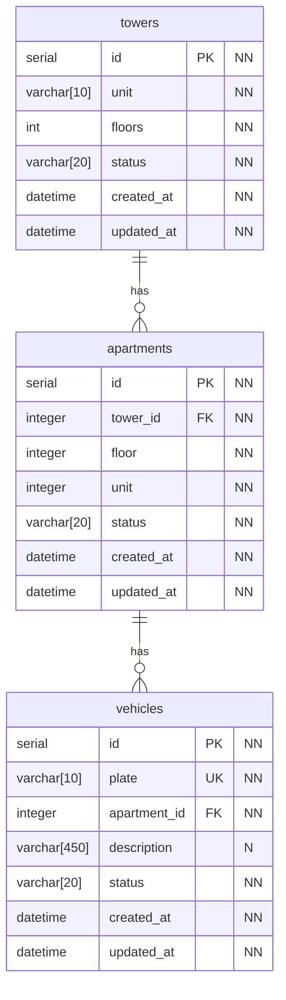

# Diagrama Entidad-Relación

```mermaid
erDiagram
    vehicles
    apartments
    towers

    towers {
        serial id PK "NN"
        varchar[10] unit "NN"
        int floors "NN"
        varchar[20] status "NN"
        datetime created_at "NN"
        datetime updated_at "NN"
    }

    apartments {
        serial id PK "NN"
        integer tower_id FK "NN"
        integer floor "NN"
        integer unit "NN"
        varchar[20] status "NN"
        datetime created_at "NN"
        datetime updated_at "NN"
    }

    vehicles {
        serial id PK "NN"
        varchar[10] plate UK "NN"
        integer apartment_id FK "NN"
        varchar[450] description "N"
        varchar[20] status "NN"
        datetime created_at "NN"
        datetime updated_at "NN"
    }

    towers ||--o{ apartments : has
    apartments ||--o{ vehicles : has
```